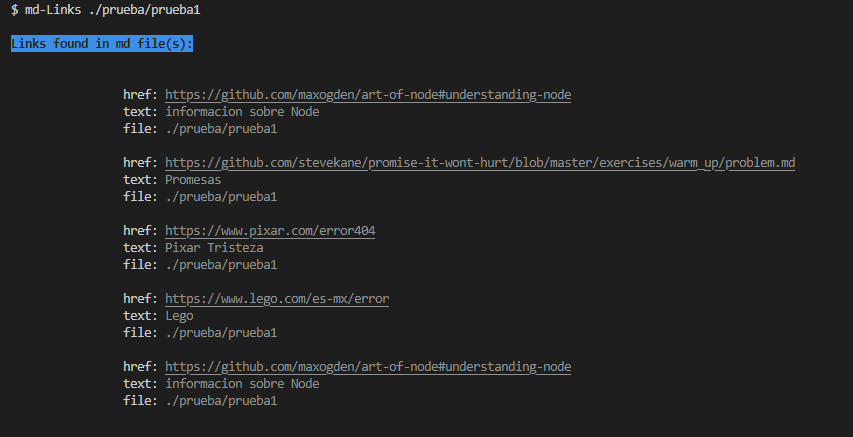
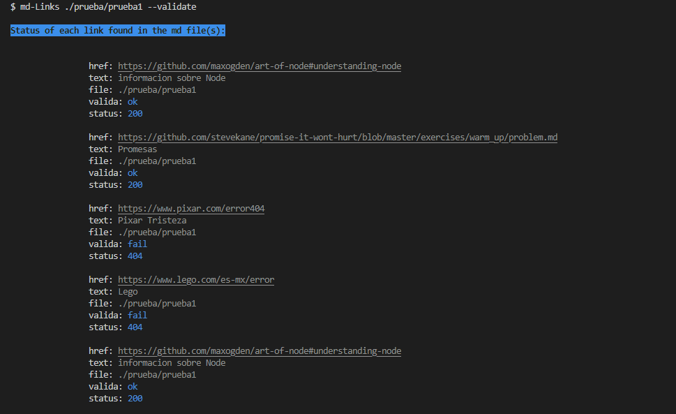
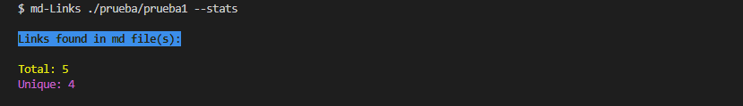
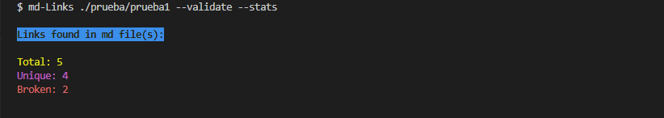

# Markdown Links

## Índice

* [1. Preámbulo](#1-preámbulo)
* [2. Resumen del proyecto](#2-resumen)
* [3. Diagrama de flujo](#3-diagrama-de-flujo)
* [4. Instalación y guía de uso](#4-instalación-y-guía-de-uso)
* [5. Herramiengtas usadas](#5-herramientas-usadas)


***

## 1. Preámbulo

Markdown es un lenguaje de marcado ligero que es muy utilizado por desarrolladores (developers), pretende facilitar la lectura al usuario, en el ámbito de programación se emplean para escribir documentos complementarios (cómo los README en Github) que proporcionan información adicional, una descripción del proyecto, instrucciones, entre otros.

Para ofrecer explicaciones más completas, en estos archivos se hace uso de mandar a información externa por medio de links. Después de un tiempo puede ser que la página a la que manda el link ya no exista ó haya cambiado de ruta, y es molesto para el usuario ya que no le ofrece lo que busca, por medio de esta librería se resuelve este problema, ya que permitirá al developer mantener actualizados los links de sus archivos .md.

## 2. Resumen 

Es una librería creada a través de [Node.js](https://nodejs.org/), que partiendo de una ruta (definida por el usuario) detecte archivos en formato [Markdown].md, después analiza los links contenidos en ese archivo mediante peticiones HTTP y asi poder validarlos entre (funcionales o no). El usuario podrá definir que hacer con los links, si sólo mostrar la validacion o estadística de total de links y links rotos,  incluso podrá realizar ambas cosas.

## 3. Diagrama de Flujo 

Para plantear mejor la solución al problema se definió el plan a seguir mediante un diagrama de flujo en el que se plasmó el funcionamiento de la librería.


## 4. Instalación y guía de uso 

### 4.1 Instalación

como primera indicación es tener instalado `Node.js`.
Instalar a través del comando NPM;
```sh
npm i karlacruz11-md-links
```
Este módulo es ejecutable como una interfaz que podamos importar con `require`
para usarlo programáticamente.

### 4.2 Guía de uso

Para ejecutarlo en la terminal es necesario escribir argumentos como;  md-Links <path> [options].
<path> es la ruta del archivo md o del directorio que contiene archivos md, seguido del argumento `options` este es opcional ya sea que elija --validate, --stats o ambas opciones de los links encontrados en archivos md. 
 
 **A continuación se muestran unos ejemplos:**

 ### md-Links path
 

 ### md-Links path --validate


### md-Links path --stats


### md-Links path --validate --stats


## 5. Herramientas usadas
* [File System](https://nodejs.org/dist/latest-v17.x/docs/api/fs.html#file-system)
* [Path module](https://nodejs.org/dist/latest-v17.x/docs/api/path.html)
* [Node-fetch](https://nodejs.org/dist/latest-v17.x/docs/api/fs.html#file-system) Para hacer peticiones HTTP.
* [Marked](https://www.npmjs.com/package/marked) A través de la función marked devuelve el contenido html.
* [Chalk](https://www.npmjs.com/package/chalk) Para darle color a los textos.


